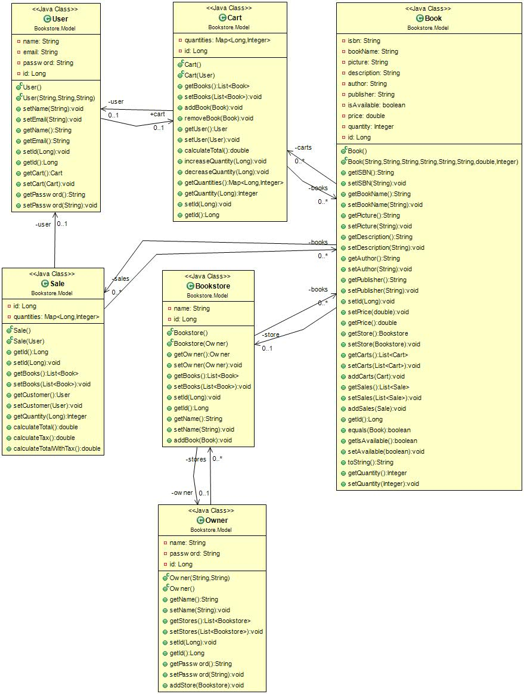

# 4806GroupProject

|Team Members           |
|-----------------------|
| Anthony Maevski-Popov |
|  Hussain Al-Baidhani  |
|    Jolar Tabungar     |
|    Kamran Sagheir     |
|   Ryan Tordesillas    |

## Project Description:
Amazin online bookstore
Bookstore Owner can upload and edit Book information (ISBN, picture, description, author, publisher,...) and inventory. User can search for, and browse through, the books in the bookstore, sort/filter them based on the above information. User can then decide to purchase one or many books by putting them in the Shopping Cart and proceeding to Checkout. The purchase itself will obviously be simulated, but purchases cannot exceed the inventory. User can also view Book Recommendations based on past purchases. This is done by looking for users whose purchases are most similar (using Jaccard distance: Google it!), and then recommending books purchased by those similar users but that the current User hasn't yet purchased.

## Heroku App
- #### [Heroku App](https://sysc-4806-project-2021.herokuapp.com/)

## Instructions
To carry out basic funcitons, follow the following instructions:

## Milestones
- #### [Milestone 1: Early prototype (March 12th, 2021)](../../milestone/1)
- #### [Milestone 2: Alpha Release (March 26th, 2021)](../../milestone/2)
- #### [Milestone 3: Final demo (April 9th, 2021)](../../milestone/3)

## Weekly Scrums
1. #### [Weekly Scrum - March 12th, 2021](../../issues/1)
2. #### [Weekly Scrum - March 21st, 2021](../../issues/45)

## UML
### Class Diagram:

### ER Diagram:
.png)

### Database Schema:

